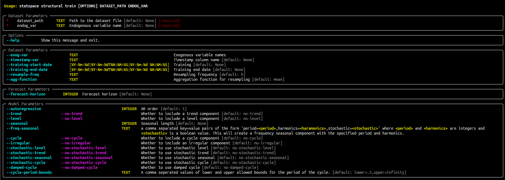
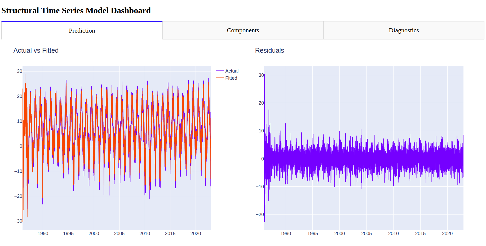
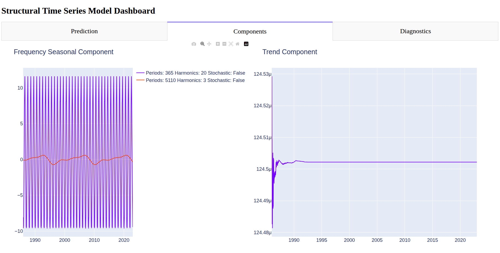
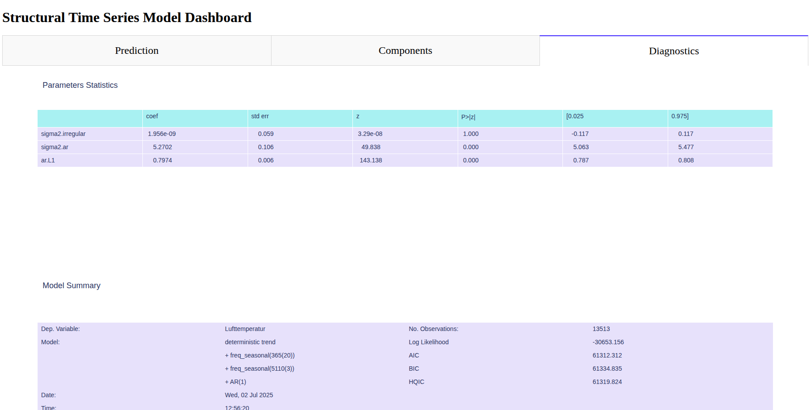
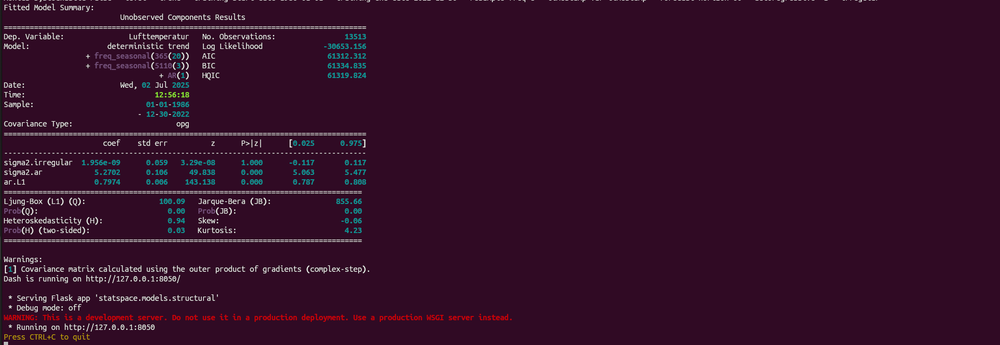

# Statspace

## Overview

This packages aims to provide a command line interface to tools for statistical
analysis of time series data. The advantage of this approach is that it allows
for trying out different tools without the need to install them, and it allows
for easy integration with other command line tools. The idea is to provide a
set of tools for time-series analysis that are simple but explainable and
interpretable. The insights gained from these tools can then be used to
inform or debug more complex models.

## Installation

This package is not yet available on PyPI, but you can install it from the
source code using pip:

```bash
pipx install .

```

To enable the auto-completion feature, you can run the following command:

```bash
statspace --install-completion
```

Now to activate it you need to restart your terminal.

## Usage

At the moment, the package provides functionalities to fetch time series data
from Sweden's Meteorological and Hydrological Institute (SMHI) using its api
and to perform structural state space modeling on the data and creates a dash
app. The entry point for getting data is `statspace data`
and for statistical modeling is `statspace structural train`.
The parameters for them could be found by running the --help
flag for each command. Here is when running help for train command:


The dash app include three tabs: one for the model prediction and it residuals,
one for the structural model components and one for the model summary and statistics.





The command outputs the model summary which are also available in the
dashboard.


